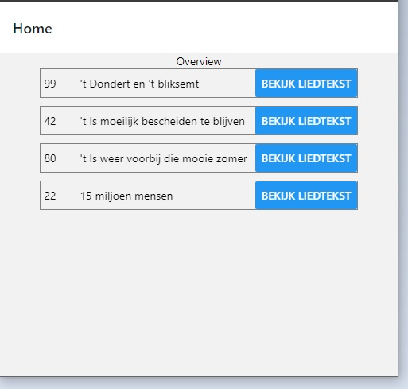

# Inleiding

De huidige app heeft als doel liedteksten makkelijk kunnen vinden en bekijken Hiervoor is een duidelijk overzicht belangrijk.

Uiteraard mag de content alleen beschikbaar zijn voor leden hiervoor daarom moet je eerst door een loginpagina heen voordat je de rest van de content kan bekijken.

# Lijst benodigdheden
1. een expo account.
2. nodejs
3. node package manager

# Installatie instructie
1. Plaats de source code in een map waar je hem wilt hebben.

2. Run het commando npm update in deze map.

3. Na het updaten run het commando npm start.

4. In de browser wordt nu een nieuw tabblad geopend kies daar publish/republish

5. In je terminal wordt je nu gevraagd of je een account wil maken of wilt inloggen kies hier "login with an existing expo account" door met pijltjes toetsen daar naar toe te navigeren en op enter te drukken.

6. Vul je gebruikersnaam of emailadres in en druk op enter.

7. Vul je wachtwoord in en druk op enter.

8. Na het uploaden kan je op in expo het project zien via https://expo.io/@{jou gebruikersnaam}/projects/{jou gekozen projectnaam}

9. Het project kan je bekijken op telefoon door met de expo app de QR code te scannen die rechts in beeld staat. Of in de browser door op de link te klikken die onder de QR code staat

# Inlog gegevens
Er zijn 2 accounts beschikbaar voor het nakijken info staat hieronder.

adminAccount => {
    naam: novi-admin
    wachtwoord: novi-frontend
}

userAccount => {
    naam: novi-user
    wachtwoord: novi-frontend
}

# Beschikbare npm commandos
`npm start` om de development server te starten.
